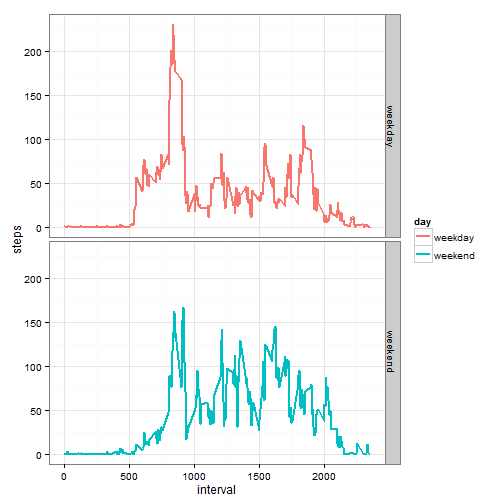

```r
require (plyr)
```

```
## Loading required package: plyr
```

```r
require (ggvis)
```

```
## Loading required package: ggvis
```

```r
require (ggplot2)
```

```
## Loading required package: ggplot2
## 
## Attaching package: 'ggplot2'
## 
## The following object is masked from 'package:ggvis':
## 
##     resolution
```

#I. Loading and preprocessing the data.

```r
data <- read.csv("activity.csv", header = TRUE)
head(data)
```

```
##   steps       date interval
## 1    NA 2012-10-01        0
## 2    NA 2012-10-01        5
## 3    NA 2012-10-01       10
## 4    NA 2012-10-01       15
## 5    NA 2012-10-01       20
## 6    NA 2012-10-01       25
```

```r
summary(data)
```

```
##      steps                date          interval     
##  Min.   :  0.00   2012-10-01:  288   Min.   :   0.0  
##  1st Qu.:  0.00   2012-10-02:  288   1st Qu.: 588.8  
##  Median :  0.00   2012-10-03:  288   Median :1177.5  
##  Mean   : 37.38   2012-10-04:  288   Mean   :1177.5  
##  3rd Qu.: 12.00   2012-10-05:  288   3rd Qu.:1766.2  
##  Max.   :806.00   2012-10-06:  288   Max.   :2355.0  
##  NA's   :2304     (Other)   :15840
```

#II. What is mean total number of steps taken per day?

###1. Calculate the total number of steps taken per day.

```r
steps.day <- ddply(data, "date", summarise, steps = sum(steps))
head(steps.day)
```

```
##         date steps
## 1 2012-10-01    NA
## 2 2012-10-02   126
## 3 2012-10-03 11352
## 4 2012-10-04 12116
## 5 2012-10-05 13294
## 6 2012-10-06 15420
```

###2. Make a histogram of the total number of steps taken each day.

```r
steps.day %>% ggvis(~steps, fill:= "skyblue") %>% 
  layer_histograms(width = 1000) %>%
  add_axis("x", title = "Total Steps per Day") %>%
  add_axis("y", title = "Frequency")
```

<!--html_preserve--><div id="plot_id547086767-container" class="ggvis-output-container">
<div id="plot_id547086767" class="ggvis-output"></div>
<div class="plot-gear-icon">
<nav class="ggvis-control">
<a class="ggvis-dropdown-toggle" title="Controls" onclick="return false;"></a>
<ul class="ggvis-dropdown">
<li>
Renderer: 
<a id="plot_id547086767_renderer_svg" class="ggvis-renderer-button" onclick="return false;" data-plot-id="plot_id547086767" data-renderer="svg">SVG</a>
 | 
<a id="plot_id547086767_renderer_canvas" class="ggvis-renderer-button" onclick="return false;" data-plot-id="plot_id547086767" data-renderer="canvas">Canvas</a>
</li>
<li>
<a id="plot_id547086767_download" class="ggvis-download" data-plot-id="plot_id547086767">Download</a>
</li>
</ul>
</nav>
</div>
</div>
<script type="text/javascript">
var plot_id547086767_spec = {
  "data": [
    {
      "name": ".0/bin1/stack2",
      "format": {
        "type": "csv",
        "parse": {
          "xmin_": "number",
          "xmax_": "number",
          "stack_upr_": "number",
          "stack_lwr_": "number"
        }
      },
      "values": "\"xmin_\",\"xmax_\",\"stack_upr_\",\"stack_lwr_\"\n-500,500,2,0\n500,1500,0,0\n1500,2500,1,0\n2500,3500,1,0\n3500,4500,1,0\n4500,5500,2,0\n5500,6500,0,0\n6500,7500,3,0\n7500,8500,2,0\n8500,9500,3,0\n9500,10500,9,0\n10500,11500,7,0\n11500,12500,4,0\n12500,13500,7,0\n13500,14500,3,0\n14500,15500,5,0\n15500,16500,0,0\n16500,17500,1,0\n17500,18500,0,0\n18500,19500,0,0\n19500,20500,1,0\n20500,21500,1,0\nNA,NA,8,0"
    },
    {
      "name": "scale/x",
      "format": {
        "type": "csv",
        "parse": {
          "domain": "number"
        }
      },
      "values": "\"domain\"\n-1600\n22600"
    },
    {
      "name": "scale/y",
      "format": {
        "type": "csv",
        "parse": {
          "domain": "number"
        }
      },
      "values": "\"domain\"\n0\n9.45"
    }
  ],
  "scales": [
    {
      "name": "x",
      "domain": {
        "data": "scale/x",
        "field": "data.domain"
      },
      "zero": false,
      "nice": false,
      "clamp": false,
      "range": "width"
    },
    {
      "name": "y",
      "domain": {
        "data": "scale/y",
        "field": "data.domain"
      },
      "zero": false,
      "nice": false,
      "clamp": false,
      "range": "height"
    }
  ],
  "marks": [
    {
      "type": "rect",
      "properties": {
        "update": {
          "stroke": {
            "value": "#000000"
          },
          "fill": {
            "value": "skyblue"
          },
          "x": {
            "scale": "x",
            "field": "data.xmin_"
          },
          "x2": {
            "scale": "x",
            "field": "data.xmax_"
          },
          "y": {
            "scale": "y",
            "field": "data.stack_upr_"
          },
          "y2": {
            "scale": "y",
            "field": "data.stack_lwr_"
          }
        },
        "ggvis": {
          "data": {
            "value": ".0/bin1/stack2"
          }
        }
      },
      "from": {
        "data": ".0/bin1/stack2"
      }
    }
  ],
  "legends": [],
  "axes": [
    {
      "type": "x",
      "scale": "x",
      "orient": "bottom",
      "title": "Total Steps per Day",
      "layer": "back",
      "grid": true
    },
    {
      "type": "y",
      "scale": "y",
      "orient": "left",
      "title": "Frequency",
      "layer": "back",
      "grid": true
    }
  ],
  "padding": null,
  "ggvis_opts": {
    "keep_aspect": false,
    "resizable": true,
    "padding": {},
    "duration": 250,
    "renderer": "svg",
    "hover_duration": 0,
    "width": 504,
    "height": 504
  },
  "handlers": null
};
ggvis.getPlot("plot_id547086767").parseSpec(plot_id547086767_spec);
</script><!--/html_preserve-->

###3. Calculate and report the mean and median of the total number of steps taken per day.

```r
mean.steps <- round(mean(steps.day$steps,na.rm=TRUE ), digits=0)
mean.steps
```

```
## [1] 10766
```

```r
median.steps <- round(median(steps.day$steps, na.rm=TRUE), digits=0)
median.steps
```

```
## [1] 10765
```
####The mean of the total number of steps taken per day is 10766. 
####The median of the total number of steps taken per day is 10765.

#III. What is the average daily activity pattern?

###1.Make a time series plot (i.e. type = "l") of the 5-minute interval (x-axis) and the average number of steps taken, averaged across all days (y-axis)


```r
interval.day <- ddply(data, "interval", summarise, steps = mean(na.omit(steps)))
head(interval.day)
```

```
##   interval     steps
## 1        0 1.7169811
## 2        5 0.3396226
## 3       10 0.1320755
## 4       15 0.1509434
## 5       20 0.0754717
## 6       25 2.0943396
```


```r
interval.day %>% ggvis(~interval, ~steps) %>% layer_lines(stroke:="blue", strokeWidth := 2) %>%
        add_axis("x", title = "Interval") %>%
        add_axis("y", title = "Average Number of Steps")
```

<!--html_preserve--><div id="plot_id496179698-container" class="ggvis-output-container">
<div id="plot_id496179698" class="ggvis-output"></div>
<div class="plot-gear-icon">
<nav class="ggvis-control">
<a class="ggvis-dropdown-toggle" title="Controls" onclick="return false;"></a>
<ul class="ggvis-dropdown">
<li>
Renderer: 
<a id="plot_id496179698_renderer_svg" class="ggvis-renderer-button" onclick="return false;" data-plot-id="plot_id496179698" data-renderer="svg">SVG</a>
 | 
<a id="plot_id496179698_renderer_canvas" class="ggvis-renderer-button" onclick="return false;" data-plot-id="plot_id496179698" data-renderer="canvas">Canvas</a>
</li>
<li>
<a id="plot_id496179698_download" class="ggvis-download" data-plot-id="plot_id496179698">Download</a>
</li>
</ul>
</nav>
</div>
</div>
<script type="text/javascript">
var plot_id496179698_spec = {
  "data": [
    {
      "name": ".0/arrange1",
      "format": {
        "type": "csv",
        "parse": {
          "interval": "number",
          "steps": "number"
        }
      },
      "values": "\"interval\",\"steps\"\n0,1.71698113207547\n5,0.339622641509434\n10,0.132075471698113\n15,0.150943396226415\n20,0.0754716981132075\n25,2.09433962264151\n30,0.528301886792453\n35,0.867924528301887\n40,0\n45,1.47169811320755\n50,0.30188679245283\n55,0.132075471698113\n100,0.320754716981132\n105,0.679245283018868\n110,0.150943396226415\n115,0.339622641509434\n120,0\n125,1.11320754716981\n130,1.83018867924528\n135,0.169811320754717\n140,0.169811320754717\n145,0.377358490566038\n150,0.264150943396226\n155,0\n200,0\n205,0\n210,1.13207547169811\n215,0\n220,0\n225,0.132075471698113\n230,0\n235,0.226415094339623\n240,0\n245,0\n250,1.54716981132075\n255,0.943396226415094\n300,0\n305,0\n310,0\n315,0\n320,0.207547169811321\n325,0.622641509433962\n330,1.62264150943396\n335,0.584905660377358\n340,0.490566037735849\n345,0.0754716981132075\n350,0\n355,0\n400,1.18867924528302\n405,0.943396226415094\n410,2.56603773584906\n415,0\n420,0.339622641509434\n425,0.358490566037736\n430,4.11320754716981\n435,0.660377358490566\n440,3.49056603773585\n445,0.830188679245283\n450,3.11320754716981\n455,1.11320754716981\n500,0\n505,1.56603773584906\n510,3\n515,2.24528301886792\n520,3.32075471698113\n525,2.9622641509434\n530,2.09433962264151\n535,6.05660377358491\n540,16.0188679245283\n545,18.3396226415094\n550,39.4528301886792\n555,44.4905660377358\n600,31.4905660377358\n605,49.2641509433962\n610,53.7735849056604\n615,63.4528301886792\n620,49.9622641509434\n625,47.0754716981132\n630,52.1509433962264\n635,39.3396226415094\n640,44.0188679245283\n645,44.1698113207547\n650,37.3584905660377\n655,49.0377358490566\n700,43.811320754717\n705,44.377358490566\n710,50.5094339622642\n715,54.5094339622642\n720,49.9245283018868\n725,50.9811320754717\n730,55.6792452830189\n735,44.3207547169811\n740,52.2641509433962\n745,69.5471698113208\n750,57.8490566037736\n755,56.1509433962264\n800,73.377358490566\n805,68.2075471698113\n810,129.433962264151\n815,157.528301886792\n820,171.150943396226\n825,155.396226415094\n830,177.301886792453\n835,206.169811320755\n840,195.924528301887\n845,179.566037735849\n850,183.396226415094\n855,167.018867924528\n900,143.452830188679\n905,124.037735849057\n910,109.11320754717\n915,108.11320754717\n920,103.716981132075\n925,95.9622641509434\n930,66.2075471698113\n935,45.2264150943396\n940,24.7924528301887\n945,38.7547169811321\n950,34.9811320754717\n955,21.0566037735849\n1000,40.5660377358491\n1005,26.9811320754717\n1010,42.4150943396226\n1015,52.6603773584906\n1020,38.9245283018868\n1025,50.7924528301887\n1030,44.2830188679245\n1035,37.4150943396226\n1040,34.6981132075472\n1045,28.3396226415094\n1050,25.0943396226415\n1055,31.9433962264151\n1100,31.3584905660377\n1105,29.6792452830189\n1110,21.3207547169811\n1115,25.5471698113208\n1120,28.377358490566\n1125,26.4716981132075\n1130,33.4339622641509\n1135,49.9811320754717\n1140,42.0377358490566\n1145,44.6037735849057\n1150,46.0377358490566\n1155,59.188679245283\n1200,63.8679245283019\n1205,87.6981132075472\n1210,94.8490566037736\n1215,92.7735849056604\n1220,63.3962264150943\n1225,50.1698113207547\n1230,54.4716981132075\n1235,32.4150943396226\n1240,26.5283018867925\n1245,37.7358490566038\n1250,45.0566037735849\n1255,67.2830188679245\n1300,42.3396226415094\n1305,39.8867924528302\n1310,43.2641509433962\n1315,40.9811320754717\n1320,46.2452830188679\n1325,56.4339622641509\n1330,42.7547169811321\n1335,25.1320754716981\n1340,39.9622641509434\n1345,53.5471698113208\n1350,47.3207547169811\n1355,60.811320754717\n1400,55.7547169811321\n1405,51.9622641509434\n1410,43.5849056603774\n1415,48.6981132075472\n1420,35.4716981132075\n1425,37.5471698113208\n1430,41.8490566037736\n1435,27.5094339622642\n1440,17.1132075471698\n1445,26.0754716981132\n1450,43.622641509434\n1455,43.7735849056604\n1500,30.0188679245283\n1505,36.0754716981132\n1510,35.4905660377358\n1515,38.8490566037736\n1520,45.9622641509434\n1525,47.7547169811321\n1530,48.1320754716981\n1535,65.3207547169811\n1540,82.9056603773585\n1545,98.6603773584906\n1550,102.11320754717\n1555,83.9622641509434\n1600,62.1320754716981\n1605,64.1320754716981\n1610,74.5471698113208\n1615,63.1698113207547\n1620,56.9056603773585\n1625,59.7735849056604\n1630,43.8679245283019\n1635,38.5660377358491\n1640,44.6603773584906\n1645,45.4528301886792\n1650,46.2075471698113\n1655,43.6792452830189\n1700,46.622641509434\n1705,56.3018867924528\n1710,50.7169811320755\n1715,61.2264150943396\n1720,72.7169811320755\n1725,78.9433962264151\n1730,68.9433962264151\n1735,59.6603773584906\n1740,75.0943396226415\n1745,56.5094339622642\n1750,34.7735849056604\n1755,37.4528301886792\n1800,40.6792452830189\n1805,58.0188679245283\n1810,74.6981132075472\n1815,85.3207547169811\n1820,59.2641509433962\n1825,67.7735849056604\n1830,77.6981132075472\n1835,74.2452830188679\n1840,85.3396226415094\n1845,99.4528301886792\n1850,86.5849056603774\n1855,85.6037735849057\n1900,84.8679245283019\n1905,77.8301886792453\n1910,58.0377358490566\n1915,53.3584905660377\n1920,36.3207547169811\n1925,20.7169811320755\n1930,27.3962264150943\n1935,40.0188679245283\n1940,30.2075471698113\n1945,25.5471698113208\n1950,45.6603773584906\n1955,33.5283018867925\n2000,19.622641509434\n2005,19.0188679245283\n2010,19.3396226415094\n2015,33.3396226415094\n2020,26.811320754717\n2025,21.1698113207547\n2030,27.3018867924528\n2035,21.3396226415094\n2040,19.5471698113208\n2045,21.3207547169811\n2050,32.3018867924528\n2055,20.1509433962264\n2100,15.9433962264151\n2105,17.2264150943396\n2110,23.4528301886792\n2115,19.2452830188679\n2120,12.4528301886792\n2125,8.0188679245283\n2130,14.6603773584906\n2135,16.3018867924528\n2140,8.67924528301887\n2145,7.79245283018868\n2150,8.13207547169811\n2155,2.62264150943396\n2200,1.45283018867925\n2205,3.67924528301887\n2210,4.81132075471698\n2215,8.50943396226415\n2220,7.07547169811321\n2225,8.69811320754717\n2230,9.75471698113208\n2235,2.20754716981132\n2240,0.320754716981132\n2245,0.113207547169811\n2250,1.60377358490566\n2255,4.60377358490566\n2300,3.30188679245283\n2305,2.84905660377358\n2310,0\n2315,0.830188679245283\n2320,0.962264150943396\n2325,1.58490566037736\n2330,2.60377358490566\n2335,4.69811320754717\n2340,3.30188679245283\n2345,0.641509433962264\n2350,0.226415094339623\n2355,1.07547169811321"
    },
    {
      "name": "scale/x",
      "format": {
        "type": "csv",
        "parse": {
          "domain": "number"
        }
      },
      "values": "\"domain\"\n-117.75\n2472.75"
    },
    {
      "name": "scale/y",
      "format": {
        "type": "csv",
        "parse": {
          "domain": "number"
        }
      },
      "values": "\"domain\"\n-10.3084905660377\n216.478301886792"
    }
  ],
  "scales": [
    {
      "name": "x",
      "domain": {
        "data": "scale/x",
        "field": "data.domain"
      },
      "zero": false,
      "nice": false,
      "clamp": false,
      "range": "width"
    },
    {
      "name": "y",
      "domain": {
        "data": "scale/y",
        "field": "data.domain"
      },
      "zero": false,
      "nice": false,
      "clamp": false,
      "range": "height"
    }
  ],
  "marks": [
    {
      "type": "line",
      "properties": {
        "update": {
          "x": {
            "scale": "x",
            "field": "data.interval"
          },
          "y": {
            "scale": "y",
            "field": "data.steps"
          },
          "stroke": {
            "value": "blue"
          },
          "strokeWidth": {
            "value": 2
          }
        },
        "ggvis": {
          "data": {
            "value": ".0/arrange1"
          }
        }
      },
      "from": {
        "data": ".0/arrange1"
      }
    }
  ],
  "legends": [],
  "axes": [
    {
      "type": "x",
      "scale": "x",
      "orient": "bottom",
      "title": "Interval",
      "layer": "back",
      "grid": true
    },
    {
      "type": "y",
      "scale": "y",
      "orient": "left",
      "title": "Average Number of Steps",
      "layer": "back",
      "grid": true
    }
  ],
  "padding": null,
  "ggvis_opts": {
    "keep_aspect": false,
    "resizable": true,
    "padding": {},
    "duration": 250,
    "renderer": "svg",
    "hover_duration": 0,
    "width": 504,
    "height": 504
  },
  "handlers": null
};
ggvis.getPlot("plot_id496179698").parseSpec(plot_id496179698_spec);
</script><!--/html_preserve-->

###2.Which 5-minute interval, on average across all the days in the dataset, contains the maximum number of steps?


```r
step.max = round(interval.day[(which.max(interval.day$steps)),], digits=0)
step.max
```

```
##     interval steps
## 104      835   206
```

#####The 835th interval contains the average maximum number of 206 steps. 
####Same results reported as a table:

Interval | Steps
-------- | -----
835      | 206  

 Table: __Interval with Average Maximum Steps__ 

#III. Imputing missing values.
 
###1.Calculate and report the total number of missing values in the dataset (i.e. the total number of rows with NAs)

```r
total.NA <- sum(is.na(data))
total.NA
```

```
## [1] 2304
```
####The total number of rows with NAs in the dataset is 2304.

###2.Devise a strategy for filling in all of the missing values in the dataset.Use the mean for that 5-minute interval.

```r
newdata <- merge(data, interval.day, by = "interval")

for (i in 1:nrow(newdata)){
 if (is.na(newdata$steps.x[i])) {
   newdata$steps.x[i] <- newdata$steps.y[i]
 }}
```

###3.Create a new dataset that is equal to the original dataset but with the missing data filled in.

```r
newdata$steps.y=NULL
names(newdata)[2]<-"steps"
newdata <- newdata[order(newdata$date, newdata$interval),] 
newdata <- newdata[c(2,3,1)]
head(newdata)
```

```
##         steps       date interval
## 1   1.7169811 2012-10-01        0
## 63  0.3396226 2012-10-01        5
## 128 0.1320755 2012-10-01       10
## 205 0.1509434 2012-10-01       15
## 264 0.0754717 2012-10-01       20
## 327 2.0943396 2012-10-01       25
```

###4.Make a histogram of the total number of steps taken each day and Calculate and report the mean and median total number of steps taken per day. 


```r
newsteps.day <- ddply(newdata, "date", summarise, steps = sum(steps))

newsteps.day %>% ggvis(~steps, fill := "cornsilk") %>% layer_histograms(width=1000) %>%
        add_axis("x", title = "Total Steps per Day") %>%
        add_axis("y", title = "Frequency")
```

<!--html_preserve--><div id="plot_id212725696-container" class="ggvis-output-container">
<div id="plot_id212725696" class="ggvis-output"></div>
<div class="plot-gear-icon">
<nav class="ggvis-control">
<a class="ggvis-dropdown-toggle" title="Controls" onclick="return false;"></a>
<ul class="ggvis-dropdown">
<li>
Renderer: 
<a id="plot_id212725696_renderer_svg" class="ggvis-renderer-button" onclick="return false;" data-plot-id="plot_id212725696" data-renderer="svg">SVG</a>
 | 
<a id="plot_id212725696_renderer_canvas" class="ggvis-renderer-button" onclick="return false;" data-plot-id="plot_id212725696" data-renderer="canvas">Canvas</a>
</li>
<li>
<a id="plot_id212725696_download" class="ggvis-download" data-plot-id="plot_id212725696">Download</a>
</li>
</ul>
</nav>
</div>
</div>
<script type="text/javascript">
var plot_id212725696_spec = {
  "data": [
    {
      "name": ".0/bin1/stack2",
      "format": {
        "type": "csv",
        "parse": {
          "xmin_": "number",
          "xmax_": "number",
          "stack_upr_": "number",
          "stack_lwr_": "number"
        }
      },
      "values": "\"xmin_\",\"xmax_\",\"stack_upr_\",\"stack_lwr_\"\n-500,500,2,0\n500,1500,0,0\n1500,2500,1,0\n2500,3500,1,0\n3500,4500,1,0\n4500,5500,2,0\n5500,6500,0,0\n6500,7500,3,0\n7500,8500,2,0\n8500,9500,3,0\n9500,10500,9,0\n10500,11500,15,0\n11500,12500,4,0\n12500,13500,7,0\n13500,14500,3,0\n14500,15500,5,0\n15500,16500,0,0\n16500,17500,1,0\n17500,18500,0,0\n18500,19500,0,0\n19500,20500,1,0\n20500,21500,1,0"
    },
    {
      "name": "scale/x",
      "format": {
        "type": "csv",
        "parse": {
          "domain": "number"
        }
      },
      "values": "\"domain\"\n-1600\n22600"
    },
    {
      "name": "scale/y",
      "format": {
        "type": "csv",
        "parse": {
          "domain": "number"
        }
      },
      "values": "\"domain\"\n0\n15.75"
    }
  ],
  "scales": [
    {
      "name": "x",
      "domain": {
        "data": "scale/x",
        "field": "data.domain"
      },
      "zero": false,
      "nice": false,
      "clamp": false,
      "range": "width"
    },
    {
      "name": "y",
      "domain": {
        "data": "scale/y",
        "field": "data.domain"
      },
      "zero": false,
      "nice": false,
      "clamp": false,
      "range": "height"
    }
  ],
  "marks": [
    {
      "type": "rect",
      "properties": {
        "update": {
          "stroke": {
            "value": "#000000"
          },
          "fill": {
            "value": "cornsilk"
          },
          "x": {
            "scale": "x",
            "field": "data.xmin_"
          },
          "x2": {
            "scale": "x",
            "field": "data.xmax_"
          },
          "y": {
            "scale": "y",
            "field": "data.stack_upr_"
          },
          "y2": {
            "scale": "y",
            "field": "data.stack_lwr_"
          }
        },
        "ggvis": {
          "data": {
            "value": ".0/bin1/stack2"
          }
        }
      },
      "from": {
        "data": ".0/bin1/stack2"
      }
    }
  ],
  "legends": [],
  "axes": [
    {
      "type": "x",
      "scale": "x",
      "orient": "bottom",
      "title": "Total Steps per Day",
      "layer": "back",
      "grid": true
    },
    {
      "type": "y",
      "scale": "y",
      "orient": "left",
      "title": "Frequency",
      "layer": "back",
      "grid": true
    }
  ],
  "padding": null,
  "ggvis_opts": {
    "keep_aspect": false,
    "resizable": true,
    "padding": {},
    "duration": 250,
    "renderer": "svg",
    "hover_duration": 0,
    "width": 504,
    "height": 504
  },
  "handlers": null
};
ggvis.getPlot("plot_id212725696").parseSpec(plot_id212725696_spec);
</script><!--/html_preserve-->


```r
mean.steps2 <- round(mean(newsteps.day$steps,na.rm=TRUE ), digits=0)
mean.steps2
```

```
## [1] 10766
```

```r
median.steps2 <- round(median(newsteps.day$steps, na.rm=TRUE), digits=0)
median.steps2
```

```
## [1] 10766
```
####The mean of the total number of steps taken per day is 10766. 
####The median of the total number of steps taken per day is 10766.

###Do these values differ from the estimates from the first part of the assignment? What is the impact of imputing missing data on the estimates of the total daily number of steps?

The mean is the same as in the first part: 10,766. The median increased from 10,765 to 10,766.

The new histogram is very similar to the histogram from the first part. However, the highest frequency increased and moved to the right from 10,000 to 11,000 steps per day.

#IV. Are there differences in activity patterns between weekdays and weekends?

###1.Create a new factor variable in the dataset with two levels - "weekday" and "weekend" indicating whether a given date is a weekday or weekend day.


```r
newdata$day <- ifelse(weekdays(as.Date(newdata$date)) %in% c("Saturday", "Sunday"), "weekend", "weekday")
head(newdata)
```

```
##         steps       date interval     day
## 1   1.7169811 2012-10-01        0 weekday
## 63  0.3396226 2012-10-01        5 weekday
## 128 0.1320755 2012-10-01       10 weekday
## 205 0.1509434 2012-10-01       15 weekday
## 264 0.0754717 2012-10-01       20 weekday
## 327 2.0943396 2012-10-01       25 weekday
```

###2.Make a panel plot containing a time series plot (i.e. type = "l") of the 5-minute interval (x-axis) and the average number of steps taken, averaged across all weekday days or weekend days (y-axis). 


```r
daydata <- ddply(newdata, .(interval, day), summarise, steps = mean(steps))
head(daydata)
```

```
##   interval     day      steps
## 1        0 weekday 2.25115304
## 2        0 weekend 0.21462264
## 3        5 weekday 0.44528302
## 4        5 weekend 0.04245283
## 5       10 weekday 0.17316562
## 6       10 weekend 0.01650943
```

```r
tsplot <- ggplot(daydata, aes(x = interval, y = steps, colour = day)) + 
    geom_line(size=1) + facet_grid(day ~ .) + theme_bw() 

tsplot
```

 

